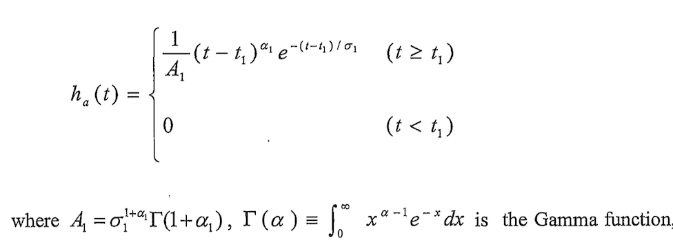
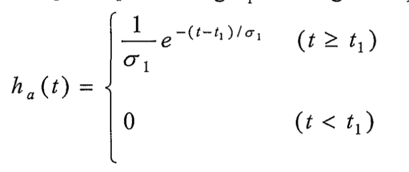
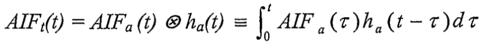
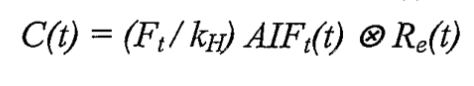
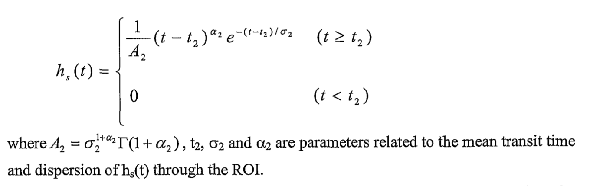
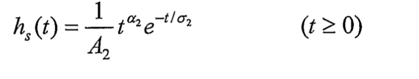
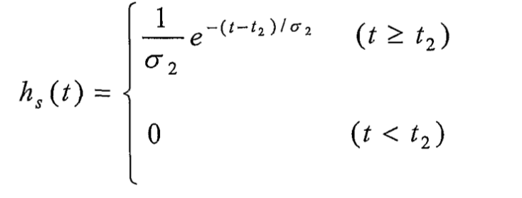
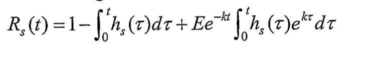
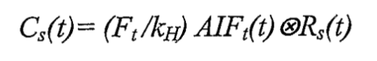
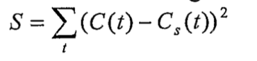

# CT专利

## notation

$AIF_a(t)$: arterial input function in the vessel(artery) leading to ROI

$AIF_t(t)$: arterial input function of the vessel at the entry to the ROI

$VIF_a(t)$: venous input function 

$h_a(t)$: arterial transport function 

$h_e(t)$: tissue transport function

$h_s(t)$: simulated transport function

$C(t)$: contrast agent concentration

$C_s(t)$: simulated contrast agent concentration 

$R_e(t)$: impulse residue function (IRF)

$R_s(t)$: simulated tissue IRF 

$H_a$: arterial hematocrit   

$H_t$: tissue hematocrit 

$F_t$: blood flow

## typical methods of obtaining quantitative perfusion indices

- convert signal intensity profile to the contrast concentration profile depending on the type of imaging modality 显像模式
- measure the arterial input function (AIF) from a feeding vessel to the tissue of interest
- measure the tisssue profile
- extract the tissue impulse residue function (IRF) from the AIF and tissue profile using deconvolution
- calculate quantitative perfusion indices including blood flow (BF), blood volume (BV), and mean transit time (MTT) using IRF
  
  ### disadvantages
  
  measured AIF has a delay and dispersion before it reaches the tissues of interest, causing overestimation of the MTT and underestimation of the BF.
  
  ## 专利steps of deriving blood perfusion indicies for ROI
- administer a contrast agent to the subject during a dynamic imaging scan
- converting signal intensity data from **raw images** of the scan into contrast agent concentration data
- deriving parameters from the contrast agent concentration data using at least one transport function that accounts for delay and dispersion of the contrast agent
- calculating the blood perfusion indices from the derived parameters
  
  ## computer steps for deriving blood perfusion indicies (according to fig 5)
- retrive raw image data including signal intensity data from a dynamic imaging scan of the subject after the contrast agent is administered to the subject
- convert signal intensity data included in the retrieved raw image data into contrast agent concentration data
- plot contrast agent concentration dadta $C(t)$ v.s. time
- search pixels to find optimal AIF (VIF) based on criteria (criteria is early arrival, high and narrow peak for AIF, and later arrival, high and broad peak with maximum peak area for VIF)
- display searched pixels of AIF(VIF)
- plot AIF (VIF) time curves
- find best pixel until optimal AIF (VIF) is found
- apply the GVF to represent $h_a(t)$ in a first model
- estimate $t_1$ from $C(t)$ and $AIF_a(t)$ curves
- estimate $\sigma_1$ using relative ispersion
- calculate an estimate for $h_a(t)$
- calculate $AIF_t(t)$ using convolution of $AIF_a(t)$ and $h_a(t)$
- calculate estimate for $F_t$ and $R_e(t)$
- calculate estimated transport function $h_e(t)$
- derive $t_2$, $\alpha_2$, $\sigma_2$ from $h_e(t)$ curve and Mean Transit Time and Peak Rise Time equations
- derive $h_s(t)$ knowing $t_2$, $\alpha_2$, $\sigma_2$ using the second model
- determine $R_s(t)$
- calculate $C_s(t)$ using $AIF_t(t)$, $F_t$, $k_H$, and $R_s(t)$  
- use a least squares method to fit $C_s(t)$ to $C(t)$ and optimize $F_t$, $t_1$, $\sigma_1$, $\alpha_1$, $t_2$, $\sigma_2$, $\alpha_2$
- calculate the blood perfusion indices from the derived parameters

*Notice*

- transport function may represent a probability distribution function of transit times of the contrast agent through the subject (mimic the delay and dispersion of the contrast agent). 

- the transport function uses a first model to represent $h_a(t)$ through a vessel leading to the ROI, and uses a second model to represent $h_e(t)$ through ROI 

- need to select an arterial input function $AIF_a(t)$ in the vessel, preferably an artery leading to the ROI,by searching pixels taken of the contrast agent concentration data

- represent $h_a(t)$ using a gamma-variate function (GVF):
  
  $t_1$: the time taken for the contrast agent to move from the initial measurement of $AIF_a(t)$ to a vessel, preferably an artery, at the entry to the ROI 
  $\sigma_1$ and $\alpha_1$: related to the mean transit time and dispersion of $h_a(t)$  
  After deriving values for $t_1$ and $\sigma_1$ and setting $\alpha_1 = 0$, we have
  

- determine an estimate for the arterial input function $AIF_t(t)$ of the vessel at the entry to the ROI:
  

- determine an estimate of blood flow $F_t$ and estimate of the tissue IRF $R_e(t)$ from the convolution of
  
  where $k_H = (1-H_a)/(1-H_t)$ is a correction constant taking into account different values of arterial hematocrit $H_a$ and tissue hematocrit $H_t$ since the contrast agent remains in the extracellular fraction of blood (plasma).  
  The hematocrit is the volume fraction of cells in the blood, which has a typical value of $H_a ~= 0.45$ for large vessels such as the artery and a value of $H_t ~= 0.25$ for small vessels such as capillaries in tissue 

- determine an estimate for the tissue transport function $h_e(t)$ from the estimated $R_e(t)$:
  

- determine a rise time and a mean transmit time of $h_e(t)$ in order to determine values of parameters $\alpha2$ and $\sigma_2$ by assuming $t_2=0$,  or determining a peak height and a mean transit time of $h_e(t)$ in order to determine values of parameters $\alpha2$ and $\sigma_2$ by assuming $\alpha_2=0$, where $\alpha2$, $\sigma_2$, $t_2$ are parameters related to mean transit time and dispersion of $h_e(t)$

- represent a simulated transport function $h_s(t)$ using GVF in the second model:
    
  setting $t_2=0$ we have
    
  or setting $\alpha_2=0$
    

- determine a simulated tissue IRF $R_s(t)$:
  
  
  - in the case that the contrast agent does not always remain in the vascular system, such as in a tumour in the subject in order to determine blood perfusion indices and permeability indices using: 
    
    E is the extraction fraction of the tracer in the blood stream that leaks out of the vessel into tissue, and the tracer clearance rate constant $k= E*F_t/V_e$ is a rate constant at which the leaked contrast agent diffuses back into the blood stream and leaves the tissue, $V_e$ is volume fraction of the extravascular and extracellular space (EES). The permeability 渗透 surface area product PS can be determined by $PS = -F_t*ln(1-E)$

- determine a simulated contrast agent concentration $C_s(t)$:
  

- fit the simulated $C_s(t)$ to $C(t)$ using a least squares method according to:
  

- need to optimize the parameters $F_t$, $t_1$, $\sigma_1$, $\alpha_1$, $t_2$, $\sigma_2$, $\alpha_2$ by minimizing S iteratively
  
  - reduce the number of adjustabl parameters by fixing $\alpha_1=0$ and $t_2=0$, or fixing $\alpha_1=0$ and $\alpha_2=0$, leading to five adjustable parameters
  - reduce the number of adjustable parameters by fixing a relative dispersion, $\beta_1=\sigma_1/(\sigma_1+t_1)$ of $h_a(t)$ resulting in $\sigma_1$ dependent on $t_1$ hence leading to four adjustable parameters

- calculate quantitative blood perfusion indicies from the optimized parameters$F_t$, $t_1$, $\sigma_1$, $\alpha_1$, $t_2$, $\sigma_2$, $\alpha_2$.  
  perfusion indicies include blood flow, blood vlolume, mean transit time, arterial delay time, arterial dispersion time, or relative arterial dispersion, tissue dispersion time or relative tissue dispersion

- Preferably ROI is a tissue. ROI maybe a pixel or a plurality of pixels in a tissue.

- determine a venous input function ($VIF_a(t)$) from a draining vein 导血管 to estimate an $AIF_a(t)$ where a selected artery has partial voluming and the vein being larger than artery 
  determine the profile of a venous input function ($VIF_a(t)$) from a large draining vein. The $AIF_a(t)$ may then be scaled up to have the same first-pass bolus peak area as the $VIF_a(t)$ to minimize partial voluming (PV) effect from the $AIF_a(t)$. The first-pass $AIF_a(t)$ and $VIF_a(t)$ profiles can be obtained by fitting the profiles to gamma-variate function (GVF) profiles respectively to remove contrast recirculation effects. 

- repeat entire process (except for selecging AIF and/or VIF) on a pixel-by-pixel basis to produce quantitative maps of the perfusion indicies